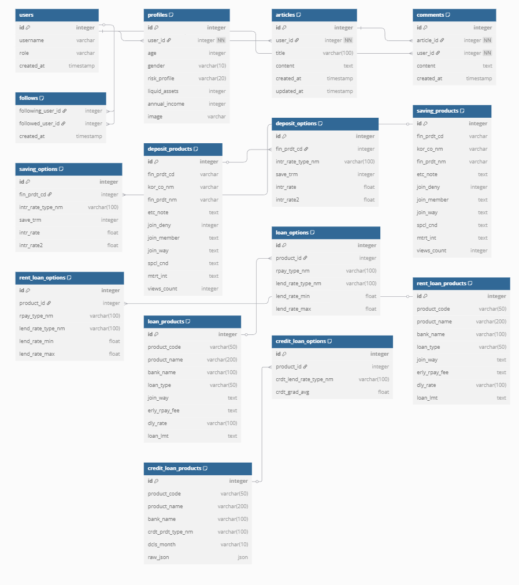

1. 팀원 정보 및 업무 분담 내역 
    - 팀장 : 박준하 
    - 팀원 : 김태균 

    - 업무 분담 
        - 박준하 
            1. 예금 및 적금 비교 
            2. 국제 환율 계산 
            3. 국제 금/은 시세 
            4. 주변 은행 찾기 
            5. AI 금융 상품 추천 
        
        - 김태균 
            1. 데이터 수집 기능 
            2. 로그인 / 로그아웃 / 회원가입 
            3. 검색 기업 영상 
            4. 프로필 및 커뮤니티 
            5. AI 금융 상품 추천 

--- 

2. 목표 서비스 구현 및 실제 구현 정도 
    - 필수 요구사항은 모두 구현 완료 
    - 또한 환율 계산기 기능 추가 

--- 

3. 데이터베이스 모델링 
    - 

--- 

4. 금융 상품 추천 알고리즘에 대한 기술적 설명 
    - ChatGPT를 활용하여 DB에 저장된 user의 profile과 금융 상품들, 그리고 사용자가 작성하는 목적을 조회 및 비교해 가장 적절한 금융 상품 하나만 추천하도록 알고리즘을 작성했습니다. 

--- 

5. 핵심 기능에 대한 설명 
    - 사용자의 상황에 맞춰 ChatGPT가 선정한 5개의 금융 카테고리(예금, 적금, 주택담보대출, 전세자금대출, 개인신용대출) 중 가장 적절한 하나의 카테고리를 선정해서 그 카테고리의 상품 중 가장 적절한 것을 추천 

--- 

6. 생성형 AI를 활용한 부분 
    - 스타일링(CSS)
    - AI 금융 상품 추천 알고리즘 
    - 디버깅 

--- 

7. 기타(느낀점 및 후기)
    - 박준하 
    - 느낀점 : 
        1. 실제 금융 API 연동 경험 - 지도(Kakao), 환율(alpha vantage), 금융감독원 API 등 다양한 외부 데이터를 연동하면서 API 연동 능력을 체득할 수 있었습니다. 

        2. AI를 활용한 맞춤형 추천 구현 - 사용자 정보를 기반으로 GPT 프롬프트를 팀원과 함께 설계하며 금융 상품을 추천하는 기능을 구현하면서, 프롬프트 설계와 결과 해석의 중요성을 체감했습니다.

        3. 프론트와 백엔드 전반적인 구현 능력 강화 - 프론트(Vue)와 백엔드(Django REST API)를 모두 다루면서, 데이터 흐름에 대한 전반적인 이해가 크게 향상되었습니다.

        4. 팀 프로젝트 내 협업 역량 강화 - 다양한 기능 중 지도, 환율, 예적금 비교, 금/은 시세, AI 추천을 구현하면서, 책임감을 가지고 개발을 진행할 수 있었습니다.

    - 김태균 
    - 느낀점 : 
        1. 프로젝트를 진행하면서 일단 이것 저것 만들고 나서 생각을 하니 시작 전에 왜 먼저 기획과 구조 구상을 해야 하는지에 대해서 절실하게 깨닫게 되었습니다. 

        2. 생각보다 최종 프로젝트 기간이라고 주어진 일주일이라는 시간이 매우 짧았습니다. 당연히 요구사항을 만족하는데 일주일이라는 시간이 넉넉할 것이라 생각을 했고, 여유롭게 작업에 임했으나 잦은 오류, 의도한대로 작동하지 않는 기능들이 저를 힘들게 했었습니다. 팀장의 권유로 작업을 미리 시작한 것이 정말 다행이었다고 생각합니다. 

- 기타 
    - 계정 아이디 : admin 
    - 계정 비밀번호 : ssafy123

    - 또한 fixtures 데이터를 loaddata 시엔 반드시 products 먼저 수행해야 합니다. 
    - 그러나 DB에 모든 데이터를 이미 담아 두었기에 loaddata 할 필요는 없습니다. 